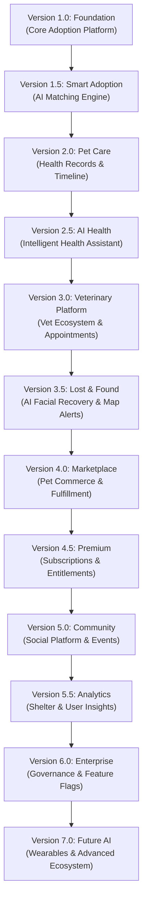

# PawMatch Product Roadmap

```text
Project:         PawMatch
Document:        Product Roadmap
Version:         1.0
Status:          Approved / Active Draft
Last Updated:    July 29, 2026
Document Owner:  PawMatch Product & Engineering Teams
```

---

## Table of Contents

- [1. Vision](#1-vision)
- [2. Development Philosophy](#2-development-philosophy)
- [3. Product Release Roadmap](#3-product-release-roadmap)
- [4. Version Details](#4-version-details)
  - [Version 1.0 – Foundation](#version-10--foundation)
  - [Version 1.5 – Smart Adoption](#version-15--smart-adoption)
  - [Version 2.0 – Pet Care](#version-20--pet-care)
  - [Version 2.5 – AI Health](#version-25--ai-health)
  - [Version 3.0 – Veterinary Platform](#version-30--veterinary-platform)
  - [Version 3.5 – Lost & Found](#version-35--lost--found)
  - [Version 4.0 – Marketplace](#version-40--marketplace)
  - [Version 4.5 – Premium](#version-45--premium)
  - [Version 5.0 – Community](#version-50--community)
  - [Version 5.5 – Analytics](#version-55--analytics)
  - [Version 6.0 – Enterprise](#version-60--enterprise)
  - [Version 7.0 – Future AI](#version-70--future-ai)
- [5. Roadmap Timeline](#5-roadmap-timeline)
- [6. Dependencies](#6-dependencies)
- [7. Future Enhancements](#7-future-enhancements)
- [8. Conclusion](#8-conclusion)

---

## 1. Vision

The long-term vision of **PawMatch** is to establish the ultimate, end-to-end, AI-powered pet ecosystem—spanning pet adoption, lifecycle health care, veterinary integration, lost-and-found safety nets, social community, and smart pet tech.

Rather than attempting a monolithic "big-bang" release that delays value delivery and introduces operational complexity, PawMatch is designed for **incremental, iterative evolution**. Each release represents a well-bounded, production-grade milestone that introduces immediate value to adopters, shelters, veterinarians, and pet owners.

### Key Goals of Incremental Delivery

- **Faster Time-to-Market**: Ship core functional modules rapidly, allowing users and animal shelters to benefit from the platform early.
- **Simplified & Targeted Testing**: Isolate test surfaces per release milestone to maintain high software quality, test coverage, and security assurance.
- **Continuous User Feedback Loops**: Gather real-world user metrics and shelter feedback after each phase to inform and refine subsequent product design.
- **Lower Deployment & Operational Risk**: Minimize infrastructure friction and deployment risks by pushing smaller, thoroughly vetted change sets.
- **Continuous Delivery & Evolution**: Establish reliable CI/CD practices and clean service boundaries, enabling non-disruptive upgrades across all platform layers.

---

## 2. Development Philosophy

PawMatch follows an agile, domain-driven architectural approach. Every version milestone adheres strictly to five foundational principles:

1. **Production Ready**: Every release tagged for public deployment must meet enterprise standards for stability, performance, security, and error handling. No "half-finished" features are pushed to production.
2. **Meaningful Feature Increments**: Each version solves a tangible user problem and expands the core value proposition for targeted user cohorts.
3. **Strict Backward Compatibility**: Data schemas, API interfaces, user preferences, and service contracts maintain forward and backward compatibility to guarantee zero downtime and smooth user migrations.
4. **Scalable Architecture**: Database design, caching tiers, micro-tier modularity, and background worker queues are continuously optimized to support exponential growth in users, pet profiles, and media storage.
5. **Clean Architecture & Maintainability**: Separation of concerns (Presentation, Domain Logic, Data Access, AI Pipelines) ensures that all future releases smoothly extend and build upon previous versions without code bloat or technical debt.

---

## 3. Product Release Roadmap

| Version | Release Name | Primary Goal | Target Horizon |
| :--- | :--- | :--- | :--- |
| **V1.0** | **Foundation** | Core Adoption Platform & Onboarding | Phase 1 |
| **V1.5** | **Smart Adoption** | AI-Assisted Compatibility & Matching Engine | Phase 1.5 |
| **V2.0** | **Pet Care** | Comprehensive Pet Lifecycle & Medical Health Management | Phase 2 |
| **V2.5** | **AI Health** | Intelligent Health Advisory & Emergency Guidance Assistant | Phase 2.5 |
| **V3.0** | **Veterinary Platform** | Integrated Vet Verification & Tele-Consultation Ecosystem | Phase 3 |
| **V3.5** | **Lost & Found** | Rapid AI Facial Recovery & Geospatial Alert Network | Phase 3.5 |
| **V4.0** | **Marketplace** | Integrated Pet Commerce, Supplies & Fulfillment | Phase 4 |
| **V4.5** | **Premium** | Monetization, Subscription Tiers & Usage Limits | Phase 4.5 |
| **V5.0** | **Community** | Social Network, Pet Stories & Local Community Events | Phase 5 |
| **V5.5** | **Analytics** | Data-Driven Insights, Shelter Reports & AI Metrics | Phase 5.5 |
| **V6.0** | **Enterprise** | Governance, Audit Logging, Feature Flags & Platform Admin | Phase 6 |
| **V7.0** | **Future AI** | Next-Gen Bio-Sensors, IoT Wearables & Advanced AI | Phase 7 |

---

## 4. Version Details

---

### Version 1.0 – Foundation

#### Purpose
Establish the foundational infrastructure and core marketplace for pet adoption, enabling animal shelters to showcase pets and adopters to discover, inspect, and apply for pets securely.

#### Key Features
- Multi-role user authentication and session management.
- Shelter partner verification and badge issuance.
- Rich pet listing management (photos, species, breed, age, temperament, medical status).
- Structured adoption application workflow with status tracking.
- Admin portal for platform moderation and shelter onboarding.

#### Modules Included
- **Authentication**: JWT & OAuth2 authentication, secure password hashing, session control.
- **User Management**: Profile creation, contact management, account settings.
- **RBAC**: Role-Based Access Control (Adopters, Shelter Managers, Verification Staff, System Admins).
- **Shelter Verification**: Document submission, manual/automated shelter credential verification workflow.
- **Shelter Dashboard**: Shelter-facing console to manage pet inventories, applications, and communications.
- **Pet Listings**: High-performance pet catalog creation, image uploading, status tracking (Available, Pending, Adopted).
- **Search & Filters**: Multi-faceted search by species, breed, age, gender, size, location, and shelter.
- **Adoption Requests**: Standardized application submission, status management (Submitted, Under Review, Approved, Rejected).
- **Notifications**: Email and transactional in-app notifications for status updates and messages.
- **User Profiles**: Adopter lifestyle preferences, living conditions, experience level, and contact details.
- **Admin Dashboard**: System administration portal for managing users, approving shelters, and monitoring platform metrics.

#### Target Users
- Pet Adopters seeking verified shelter animals.
- Animal Shelters and Rescue Organizations managing adoption drives.
- Platform Administrators establishing compliance and security.

#### Success Criteria
- Fully functional, end-to-end adoption application workflow.
- Zero critical vulnerability findings during security audit.
- Successful onboarding and verification of baseline shelter partners.
- Stable multi-tenant database operations in production environment.

---

### Version 1.5 – Smart Adoption

#### Purpose
Enhance adopter-pet matching efficiency by introducing machine learning models that evaluate user lifestyle preferences against pet behavioral profiles.

#### Key Features
- Algorithmic compatibility scoring (0–100%) based on living environment, activity level, and pet traits.
- Personalized recommendation engine surfacing high-match animals.
- Interactive saved pets and favorites wishlist.
- Natural language and intent-aware search capabilities.

#### Modules Included
- **AI Matching Engine**: Machine learning model comparing adopter profile vectors against pet behavioral traits.
- **Compatibility Score**: Dynamic scoring breakdown highlighting suitability across exercise, space, experience, and home environment.
- **Personalized Recommendations**: Home feed curation tailored to individual user browsing history and preference profiles.
- **Saved Pets**: Single-click bookmarking of listings for future evaluation.
- **Favorites**: Organizational lists allowing users to prioritize target pets.
- **Enhanced Search**: Natural language filter processing (e.g., "Good with kids in small apartment").

#### Target Users
- Prospective Adopters seeking compatible long-term companion animals.
- Shelters looking to reduce pet return rates due to lifestyle mismatches.

#### Success Criteria
- At least 25% increase in completed adoption applications per active user.
- Measurable drop in post-adoption return rates driven by mismatch warnings.
- Sub-200ms latency for compatibility score calculations on listing views.

---

### Version 2.0 – Pet Care

#### Purpose
Transition PawMatch from an adoption platform into a lifelong pet management system by providing owners with tools to log health, medical, and vaccination records.

#### Key Features
- Centralized digital medical vault for pet health history.
- Automated immunization and medication reminder notifications.
- Document storage for medical records, adoption papers, and licenses.
- Interactive health timeline illustrating growth and care events.

#### Modules Included
- **Pet Profiles**: Comprehensive profile post-adoption (microchip ID, weight tracker, diet specs, emergency contact).
- **Vaccination Records**: Digital immunization tracker with expiration alerts.
- **Medical History**: Historical record log for surgeries, chronic conditions, and recurring treatments.
- **Documents**: Secure cloud file vault for PDFs, prescriptions, and veterinary invoices.
- **Reminders**: Configurable push/email/SMS alerts for vet visits, medications, and grooming.
- **Health Timeline**: Visual chronological feed summarizing all medical and health milestones.

#### Target Users
- Pet Owners needing organized health management for one or more pets.
- Foster Parents tracking temporary medical regimes.

#### Success Criteria
- Over 60% of active adopters convert their adopted pets into active Pet Care profiles.
- High user retention driven by automated health reminder engagement.

---

### Version 2.5 – AI Health

#### Purpose
Provide pet owners with proactive, AI-driven wellness insights, preliminary symptom triage, and personalized nutritional/training recommendations.

#### Key Features
- Conversational AI Health Assistant for 24/7 care guidance.
- Emergency preliminary triage system directing users to emergency care when needed.
- Computer vision for breed identification and preliminary dermatological/symptom check.
- Custom nutrition and behavioral training planners.

#### Modules Included
- **AI Health Assistant**: Natural Language Processing (NLP) chatbot trained on veterinary triage protocol datasets.
- **Emergency Guidance**: Immediate escalation framework identifying critical symptoms (e.g., bloat, toxin ingestion) with emergency clinic locators.
- **Disease Detection**: Image-based symptom classifier for preliminary skin condition/eye discharge analysis (with mandatory veterinary disclaimer).
- **Breed Detection**: Vision model analyzing pet photos to identify purebred and mixed-breed compositions.
- **Nutrition Planner**: Caloric requirement calculator tailored to pet weight, age, activity, and medical needs.
- **Training Assistant**: Custom step-by-step behavioral training plans and troubleshooting guides.

#### Target Users
- Pet Parents seeking immediate health guidance and wellness optimization.
- First-time pet owners requiring training and nutrition instruction.

#### Success Criteria
- 90%+ accuracy on breed classification benchmarks.
- High user satisfaction scores for AI Health Assistant interactions.
- Clear disclaimers leading to verified veterinary follow-ups without clinical misdiagnosis risks.

---

### Version 3.0 – Veterinary Platform

#### Purpose
Connect pet owners directly with certified veterinary professionals, enabling seamless digital appointment scheduling, record sharing, and consultation notes.

#### Key Features
- Verified vet directory and clinic profile management.
- Real-time online appointment booking integrated with vet calendars.
- Secure sharing of digital Pet Care records with attending veterinarians.
- Post-consultation note sync and prescription logs.

#### Modules Included
- **Vet Registration**: Onboarding portal for veterinary practices and individual licensed clinicians.
- **Verification**: State license and credential verification pipeline.
- **Appointment Booking**: In-app booking engine supporting in-clinic and tele-consultation slots.
- **Consultation Notes**: Structured digital records authored by veterinarians and synced to pet timelines.
- **Calendar Integration**: Synchronized scheduling across vet management software and owner calendars.
- **Health Record Sharing**: Granular permission-based access sharing of V2.0 medical records with chosen clinics.

#### Target Users
- Licensed Veterinary Practitioners and Clinic Staff.
- Pet Owners desiring seamless healthcare coordination.

#### Success Criteria
- Successful onboarding of verified vet practices.
- Zero friction record transfer prior to scheduled appointments.
- High rating on appointment completion workflows.

---

### Version 3.5 – Lost & Found

#### Purpose
Deploy a rapid-response community and AI network to locate missing pets using facial recognition technology and real-time geospatial alerts.

#### Key Features
- Instant lost/found pet reporting with visual and location tagging.
- AI-driven facial and coat pattern matching comparing lost reports against found sightings.
- Interactive map highlighting missing pet radii and found reports.
- Automated push alerts sent to nearby platform users and local shelters.

#### Modules Included
- **Lost Pet Reports**: Urgent listing generator with broadcast capabilities and flyer creation.
- **Found Pet Reports**: Streamlined submission form for community members who locate stray animals.
- **AI Facial Matching**: Deep learning visual matching model matching facial structures and unique markings.
- **Map Integration**: GIS interactive mapping showing last known coordinates and sighting radiuses.
- **Nearby Alerts**: Geofenced push notification system alerting active users within a 5–10 km radius.

#### Target Users
- Distressed Pet Owners searching for missing pets.
- Community members and Good Samaritans reporting stray/found animals.
- Local Shelters cross-referencing intake animals against lost reports.

#### Success Criteria
- Visual match accuracy rate > 85% on verified pet image matches.
- Sub-minute broadcast delivery for critical nearby lost pet alerts.
- Demonstrated reduction in average time to reunite missing pets with owners.

---

### Version 4.0 – Marketplace

#### Purpose
Establish an integrated e-commerce experience for purchasing verified pet food, supplies, medications, and shelter support packages.

#### Key Features
- Curated product catalog tailored to pet profiles (breed, age, dietary restrictions).
- Multi-item shopping cart and secure multi-currency payment gateway.
- Real-time order tracking, fulfillment updates, and automated returns handling.
- Integrated shelter donation product packages ("Sponsor a Shelter Pet Kit").

#### Modules Included
- **Product Listings**: E-commerce catalog management with inventory tracking and dynamic pricing.
- **Shopping Cart**: High-performance persistent shopping cart module.
- **Checkout**: PCI-compliant checkout workflow with address verification and shipping calculation.
- **Payments**: Multi-provider payment gateway integration (Stripe, Apple Pay, Google Pay).
- **Orders**: Order processing lifecycle (Received, Processing, Shipped, Delivered).
- **Refunds**: Automated refund request evaluation and customer service dispatch.
- **Wishlist**: Saved product lists integrated with pet profile milestone recommendations.

#### Target Users
- Pet Owners looking for personalized product recommendations.
- Donors wishing to purchase supplies directly for shelter animals.

#### Success Criteria
- Smooth checkout completion rate with < 2% cart abandonment due to technical friction.
- PCI-DSS compliant secure transaction infrastructure.

---

### Version 4.5 – Premium

#### Purpose
Introduce sustainable monetization models via subscription tiers, unlocking advanced AI features, unlimited medical storage, and premium merchant perks.

#### Key Features
- Flexible tier structures (Free, PawMatch+, Family, Shelter Pro).
- Granular feature gating and AI interaction quota management.
- Automated recurring billing, invoicing, and subscription adjustments.

#### Modules Included
- **Subscription Plans**: Tier management engine defining pricing, entitlement maps, and billing cycles.
- **Premium Features**: Exclusive access to advanced AI health analytics, priority adoption queueing, and store discounts.
- **Billing**: Automated recurring payment processing, receipt generation, and dunning management.
- **Renewals**: Seamless subscription auto-renewal and upgrade/downgrade workflows.
- **Family Plans**: Multi-user account sharing allowing household members to co-manage pets.
- **AI Usage Limits**: Metered usage tracking and rate-limiting enforcement for AI requests.

#### Target Users
- Power Users seeking unlimited AI guidance and multi-pet management tools.
- Commercial partners and high-volume shelters needing specialized tools.

#### Success Criteria
- Target conversion rate from free to paid tiers meeting financial projections.
- Churn rate maintained below industry standards (< 4% monthly).

---

### Version 5.0 – Community

#### Purpose
Build an engaging social platform where pet parents, foster families, and shelters can share updates, organize local events, and build supportive networks.

#### Key Features
- Content feed with posts, photos, video snippets, and adoption success stories.
- Interactive social elements (likes, comments, media shares).
- Local pet event creation and RSVP management (adoption days, training meetups).
- Automated and human content moderation to ensure platform safety.

#### Modules Included
- **Posts**: Rich media post creation engine with tag support.
- **Comments**: Threaded discussion engine with real-time updates.
- **Likes**: Scalable social reaction mechanism.
- **Pet Stories**: Highlighted adoption transformation stories inspiring prospective adopters.
- **Events**: Geographic and interest-based event posting, ticketing, and RSVP tracking.
- **Moderation**: AI content filter (profanity, spam, animal abuse flagging) backed by admin review queues.

#### Target Users
- General PawMatch user community, pet lovers, and influencers.
- Rescue Groups organizing community adoption events.

#### Success Criteria
- High Daily Active User / Monthly Active User (DAU/MAU) engagement ratio.
- Safe, positive community atmosphere enforced by effective automated moderation.

---

### Version 5.5 – Analytics

#### Purpose
Empower decision-makers with comprehensive analytics dashboards, exposing key metrics on adoption trends, health patterns, and platform operations.

#### Key Features
- Custom reporting dashboards for shelter managers (time-to-adopt, bottleneck analysis).
- Platform-wide aggregate adoption trend analysis for research partners.
- AI-driven predictive insights highlighting shelter resource needs.

#### Modules Included
- **Shelter Analytics**: Operational metrics tracking intake, adoption velocity, and applicant drop-offs.
- **User Analytics**: Engagement metrics, feature usage heatmaps, and retention analysis.
- **AI Insights**: Predictive models surfacing trends in health queries and local breed demands.
- **Adoption Reports**: Exportable audit reports (PDF/CSV) for regulatory compliance and grant applications.
- **Dashboards**: Configurable, real-time widget-based metrics visualization.

#### Target Users
- Shelter Executives evaluating operational performance.
- Platform Product Managers and Business Intelligence Analysts.

#### Success Criteria
- Data-driven reduction in shelter pet stay durations based on operational insights.
- Sub-second dashboard render times for complex aggregate analytics queries.

---

### Version 6.0 – Enterprise

#### Purpose
Provide enterprise-grade governance, auditing, configuration management, and administrative control necessary for large multi-regional shelter networks and municipal agencies.

#### Key Features
- Immutable audit logging for security compliance and policy enforcement.
- Dynamic feature flag management allowing zero-downtime canary deployments.
- Infrastructure monitoring and system health telemetry.
- Multi-region administrative tenant controls.

#### Modules Included
- **Audit Logs**: Immutable security logs capturing all data mutations, administrative actions, and access events.
- **Feature Flags**: Dynamic runtime toggling of features per user segment, location, or tenant.
- **Monitoring**: Comprehensive telemetry tracking system latency, error rates, CPU/RAM utilization, and API SLA compliance.
- **System Configuration**: Global platform configuration management (rates, localized rules, tax settings).
- **Moderation**: Master moderation queue with granular escalation and dispute handling.
- **Platform Administration**: Enterprise tenant management, role delegation, and global system overrides.

#### Target Users
- Municipal Animal Control Agencies and National Rescue Networks.
- Enterprise System Administrators and Security Officers.

#### Success Criteria
- 99.99% system availability SLA across all operational nodes.
- Full compliance with international enterprise data security standards (SOC2, GDPR).

---

### Version 7.0 – Future AI

#### Purpose
Push the boundaries of pet tech innovation by integrating next-generation AI research, wearable bio-sensors, cross-species communication research, and smart home automation.

#### Key Features
- Bio-metric wearable telemetry integration (heart rate, activity level, sleep quality tracking).
- AI behavioral acoustic & visual sound interpretation ("Pet Translator").
- Integrated Tele-Vet AR consultation suites.
- Global cross-border pet adoption logistics assistance.

#### Modules Included
- **Pet Translator**: Machine learning acoustic/computer-vision models interpreting vocalization and body language cues.
- **Wearable Integration**: API connectors for smart collars and health wearables (e.g., GPS, heart rate, temp sensors).
- **Smart Devices**: Smart home integration (automated feeders, smart pet doors, climate monitors).
- **Tele-Vet**: Next-gen AR/VR remote veterinary examination capabilities.
- **Internationalization**: Full multi-language localization, currency conversion, and global regulatory compliance engines.
- **Advanced AI Features**: Generative AI life planning, predictive genetic health risk modeling, and voice assistant skills.

#### Target Users
- Tech-forward Pet Owners, Specialized Veterinary Researchers, and Global Adoption Networks.

#### Success Criteria
- Real-time bio-sensor data ingestion supporting thousands of telemetry streams per second.
- High accuracy on predictive health alerts triggered by wearable telemetry anomalies.

---

## 5. Roadmap Timeline



---

## 6. Dependencies

Each release version builds strictly upon the infrastructure, data schemas, and user base established in preceding milestones:

```text
V1.0 (Foundation)
 └── V1.5 (Smart Adoption)  [Requires V1.0 User Profiles, Pet Listings & Search]
      └── V2.0 (Pet Care)   [Requires Adopted/Registered Pet Profiles from V1.0/V1.5]
           └── V2.5 (AI Health)   [Requires V2.0 Pet Profiles & Medical Vault Data]
                └── V3.0 (Veterinary Platform) [Requires V2.0/V2.5 Medical History & Records]
                     └── V3.5 (Lost & Found)   [Requires V1.0 Maps, User Accounts & Photo Models]
                          └── V4.0 (Marketplace)   [Requires V1.0 Accounts & V2.0 Pet Profile Preferences]
                               └── V4.5 (Premium)   [Requires V1.5-V4.0 Modules to Gate & Monetize]
                                    └── V5.0 (Community)   [Requires V1.0-V4.5 Active User Community]
                                         └── V5.5 (Analytics)   [Requires Multi-Version Data Telemetry]
                                              └── V6.0 (Enterprise) [Requires Full Platform Surface Area]
                                                   └── V7.0 (Future AI) [Requires All Prior Capabilities]
```

- **V1.5 requires V1.0**: AI Matching operates directly on the pet listings and user profiles initialized in V1.0.
- **V2.0 requires V1.5**: Pet Care builds upon adopted and owned pet profiles established during the adoption workflow.
- **V2.5 requires V2.0**: The AI Health Assistant consumes the medical records and health timelines structured in V2.0 to provide contextual guidance.
- **V3.0 requires V2.5**: Veterinary consultation workflows require pet medical vaults (V2.0) and preliminary triage logs (V2.5) to share with licensed clinicians.
- **V3.5 requires V3.0**: Lost & Found leverages geospatial maps and AI vision pipelines developed in previous iterations.
- **V4.0 requires V3.5**: The e-commerce marketplace leverages user demographic data, pet sizing, and profile data from prior releases.
- **V4.5 requires V4.0**: Subscription monetization requires established premium features (AI Health, Advanced Matching, Marketplace discounts) to monetize effectively.
- **V5.0 requires V4.5**: Social community interactions flourish once the active user base and premium user tier structure are mature.
- **V5.5 requires V5.0**: Analytics aggregates multi-year data points across adoption, health, commerce, and community metrics.
- **V6.0 requires V5.5**: Enterprise governance controls require fully developed operational modules to manage, flag, and audit.
- **V7.0 requires all previous releases**: Next-gen IoT, tele-vet AR, and bio-sensors synthesize data from every underlying system layer.

---

## 7. Future Enhancements

The following innovative concepts are recognized as high-value opportunities intentionally positioned beyond the core roadmap horizon:

- **Smart Collars & Bio-Harnesses**: Native hardware manufacturing or OEM partnerships for real-time biometric tracking (ECG, temperature, stress levels).
- **IoT Smart Home Integration**: Direct integration with smart pet doors, automated feeders, and environmental climate controls via Matter/HomeKit protocols.
- **Augmented Reality (AR) Pet Preview**: AR mobile capabilities allowing prospective adopters to visualize a pet's scale and interaction in their physical living room before adoption.
- **Voice Assistant Skills**: Native Alexa, Google Assistant, and Siri integrations for asking health questions, setting feeding reminders, or reporting lost pets via voice commands.
- **Blockchain Pet Identity (Decentralized Passport)**: Immutable, tamper-proof blockchain-based medical passport and pedigree ownership history tracking.
- **Cross-Border International Adoption Engine**: Automated international quarantine, customs documentation, and flight companion coordination for global pet rescues.
- **Government & Municipal Shelter Integrations**: Direct API bridge into city licensing systems and municipal animal control databases for automated microchip sync.
- **Smart Home Automated Feeding & Behavior Analysis**: Computer vision cameras analyzing eating habits and camera feed analysis for separation anxiety detection.

---

## 8. Conclusion

The **PawMatch Product Roadmap** defines a clear, strategic trajectory from a lightweight, high-performance adoption marketplace to a comprehensive, AI-empowered pet ecosystem. By executing this roadmap through disciplined, production-ready incremental releases:

- **Engineering teams** maintain high code quality, clean architecture, and low technical debt.
- **Users and shelters** receive rapid, continuous value delivery without disruption.
- **Investors and stakeholders** gain transparent visibility into platform growth, capability expansion, and monetization milestones.

PawMatch remains committed to leveraging cutting-edge technology, user-centered design, and strict engineering standards to transform pet adoption and lifelong pet care worldwide.
