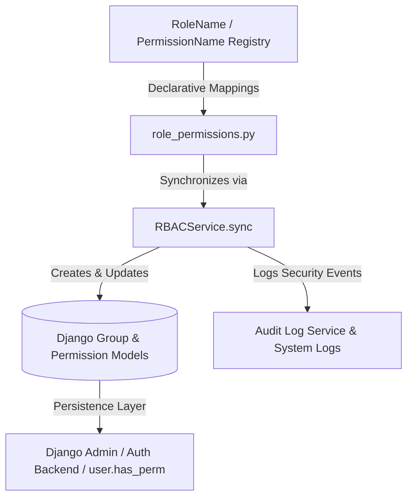

# RBAC Management & Synchronization Blueprint

```text
Document ID:     ARCHITECTURE-RBAC-SYNC
Status:          Approved Specification
Version:         1.0
Document Owner:  PawMatch Architecture & Security Team
Target Audience: Software Engineers, DevOps, Security Auditors, AI Coding Agents
Last Updated:    July 31, 2026
```

---

## 1. Overview & Architecture

PawMatch employs a multi-layered Role-Based Access Control (RBAC) and Dynamic Policy Engine architecture.
The **Role & Permission Synchronization Layer** (Phase 1.6.1) bridges the in-memory declarative role definitions (`RoleName`, `PermissionName`, `ROLE_PERMISSIONS_MAP`) with Django's native authentication framework using Django `Group` and `Permission` models as the relational persistence layer.



---

## 2. Platform Roles & Groups

The platform synchronizes the following 6 core roles to corresponding Django Groups:

| Role Constant (`RoleName`) | Django Group Display Name | Purpose & Domain Scope |
|---|---|---|
| `ADMINISTRATOR` | `Administrator` | Full administrative access to all resources and settings |
| `SHELTER_MANAGER` | `Shelter Manager` | Manage shelter profiles, pets, staff, reports, and adoptions |
| `SHELTER_STAFF` | `Shelter Staff` | Create/update pet listings, medical records, and notifications |
| `VETERINARIAN` | `Veterinarian` | Access and update pet medical records and health statuses |
| `VOLUNTEER` | `Volunteer` | View and update pet statuses, view shelter profiles |
| `ADOPTER` | `Adopter` | View pet listings, submit adoption requests, view shelter info |

---

## 3. How Synchronization Works

The `RBACService.sync()` service executes an **idempotent**, **transaction-safe** synchronization pipeline:

1. **Permission Persistence**:
   - Reads all permission strings from `PermissionName.get_all_permissions()`.
   - Parses each string into `(app_label, codename)` (e.g. `"pets.view"` → `app_label="pets"`, `codename="view"`).
   - Resolves or creates `ContentType` for the `app_label`.
   - Idempotently creates `Permission` records via `Permission.objects.get_or_create()`.

2. **Group Persistence**:
   - Ensures Django `Group` objects exist for all 6 roles without duplicating groups.

3. **Mapping & Stale Cleanup**:
   - Maps permission objects to groups according to `ROLE_PERMISSIONS_MAP`.
   - Calls `group.permissions.set(target_permissions)`, which automatically adds missing permissions and **removes stale permissions** if a permission is revoked in code.

4. **Atomicity & Rollback**:
   - The entire sync operation runs inside `@transaction.atomic`. Any database exception triggers an automatic rollback to maintain data integrity.

5. **Logging & Telemetry**:
   - Emits structured log events `RBAC_SYNC_STARTED`, `RBAC_SYNC_COMPLETED`, or `RBAC_SYNC_FAILED`.
   - Persists security audit entries in `AuditLog` including duration, timestamp, roles synchronized count, and permissions synchronized count.

---

## 4. How to Run `sync_rbac`

### Management Command (Official Mechanism)

Run the Django management command from the `backend/` directory:

```bash
python manage.py sync_rbac
```

**Example Output**:

```text
Starting RBAC Role & Permission Synchronization...

✓ Administrator
  → 13 permissions

✓ Shelter Manager
  → 11 permissions

✓ Shelter Staff
  → 6 permissions

✓ Veterinarian
  → 4 permissions

✓ Volunteer
  → 3 permissions

✓ Adopter
  → 3 permissions

Synchronization Complete
```

---

## 5. How to Add New Permissions

To introduce a new permission to PawMatch:

1. Add the permission string constant to `PermissionName` in `apps/accounts/permissions.py`:
   ```python
   class PermissionName:
       ...
       ANALYTICS_VIEW = "analytics.view"
   ```
2. Assign the new permission to appropriate roles in `ROLE_PERMISSIONS_MAP` (`apps/accounts/role_permissions.py`):
   ```python
   ROLE_PERMISSIONS_MAP = {
       RoleName.ADMINISTRATOR: PermissionName.get_all_permissions(),
       RoleName.SHELTER_MANAGER: {
           ...
           PermissionName.ANALYTICS_VIEW,
       },
   }
   ```
3. Execute `python manage.py sync_rbac`. The service automatically creates the new permission in the database and updates group mappings.

---

## 6. How to Add New Roles

To introduce a new platform role:

1. Add the role constant to `RoleName` in `apps/accounts/roles.py`:
   ```python
   class RoleName:
       ...
       AUDITOR = "AUDITOR"
   ```
2. Update `ROLE_TO_GROUP_NAME` in `apps/accounts/services/rbac_service.py`:
   ```python
   ROLE_TO_GROUP_NAME = {
       ...
       RoleName.AUDITOR: "Auditor",
   }
   ```
3. Define the role's permission set in `ROLE_PERMISSIONS_MAP` (`apps/accounts/role_permissions.py`).
4. Execute `python manage.py sync_rbac`.

---

## 7. Migration Signals vs Management Command

### Why Management Command is Primary
- Running `sync_rbac` via `post_migrate` on every single migration can slow down isolated test suites and lead to race conditions in multi-process deployment setups (e.g. Docker container restarts).
- `python manage.py sync_rbac` gives explicit control to deployment scripts (`build.sh` / CI pipelines).

### Optional Signal Support
- Automatic `post_migrate` synchronization can be enabled for development/staging by setting `ENABLE_AUTO_RBAC_SYNC = True` in settings.

---

## 8. CLI Tooling & Management Commands

PawMatch provides 3 core management commands for RBAC administration:

### 1. `python manage.py sync_rbac`
Synchronizes declarative role-permission definitions with Django Group and Permission database records.

### 2. `python manage.py list_roles`
Displays all platform roles, mapped Django group display names, and assigned permission lists.

```bash
python manage.py list_roles
```

### 3. `python manage.py list_permissions`
Displays all registered platform permissions categorized by domain namespace (`pets`, `shelters`, `adoptions`, `medical`, etc.).

```bash
python manage.py list_permissions
```

---

## 9. Django Admin Integration & Customizations

The Django Admin interface has been customized to provide comprehensive RBAC visibility:

1. **`EnhancedGroupAdmin`**:
   - Displays mapped `Role Code` (e.g. `<code>SHELTER_MANAGER</code>`).
   - Displays real-time `Permissions Count`.
   - Enables horizontal filter widgets for rapid permission management.

2. **`UserAdmin` Enhancements**:
   - **List View**: Displays `Assigned Roles` directly in the user list table.
   - **Detail View**: Includes a dedicated **Role & Authorization Summary** section rendering:
     - Color-coded badges for assigned platform roles.
     - Complete list of aggregated permissions granted to the user.
