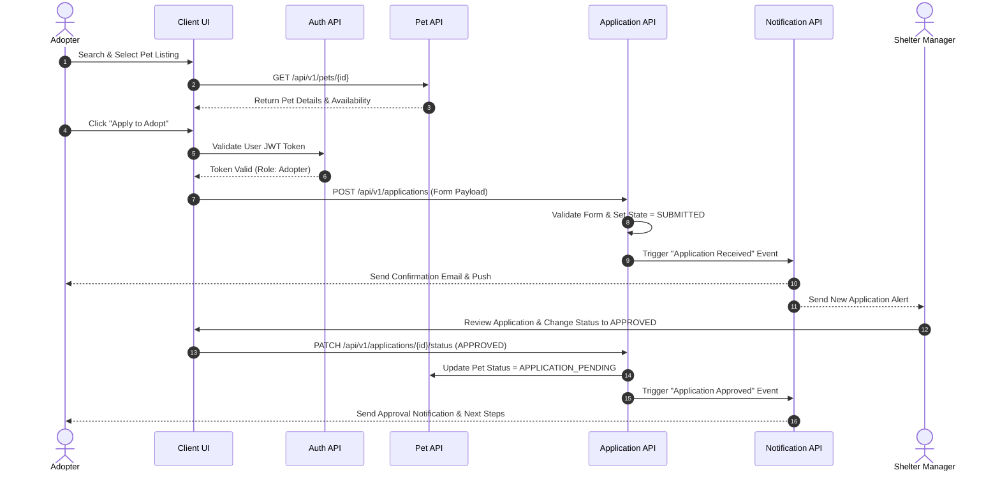
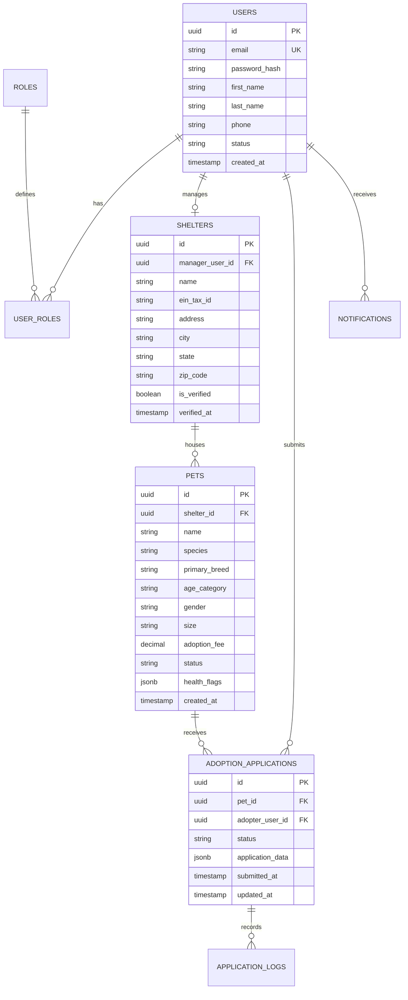

# PawMatch Version 1.0 – Foundation Specification

```text
Project:         PawMatch
Document:        Version 1.0 Feature & Module Specification
Release Target:  V1.0 – Foundation
Status:          Approved / Ready for Development
Last Updated:    July 29, 2026
Document Owner:  PawMatch Product & Core Engineering Teams
```

---

## Table of Contents

- [1. Executive Summary](#1-executive-summary)
- [2. Target User Personas & Roles](#2-target-user-personas--roles)
- [3. Key Release Objectives](#3-key-release-objectives)
- [4. Module Specifications](#4-module-specifications)
  - [4.1 Authentication & Session Control](#41-authentication--session-control)
  - [4.2 User Management](#42-user-management)
  - [4.3 Role-Based Access Control (RBAC)](#43-role-based-access-control-rbac)
  - [4.4 Shelter Verification System](#44-shelter-verification-system)
  - [4.5 Shelter Dashboard](#45-shelter-dashboard)
  - [4.6 Pet Listings & Inventory](#46-pet-listings--inventory)
  - [4.7 Search & Multi-Faceted Filters](#47-search--multi-faceted-filters)
  - [4.8 Adoption Request Workflow Engine](#48-adoption-request-workflow-engine)
  - [4.9 Notification & Communication Engine](#49-notification--communication-engine)
  - [4.10 Adopter Profiles](#410-adopter-profiles)
  - [4.11 Admin Control Panel](#411-admin-control-panel)
- [5. System Architecture & Workflow Diagrams](#5-system-architecture--workflow-diagrams)
- [6. Core Data Schema](#6-core-data-schema)
- [7. API Specification Overview](#7-api-specification-overview)
- [8. Non-Functional Requirements (NFRs)](#8-non-functional-requirements-nfrs)
- [9. Success Criteria & Definition of Done](#9-success-criteria--definition-of-done)
- [10. Transition to Version 1.5](#10-transition-to-version-15)

---

## 1. Executive Summary

**Version 1.0 (Foundation)** delivers the core production-ready infrastructure for the **PawMatch** pet adoption platform. The objective of V1.0 is to create a secure, highly scalable, and user-friendly digital adoption marketplace that bridges verified animal shelters with prospective pet adopters.

V1.0 establishes the foundational software architecture, user authentication layer, role-based access permissions, shelter verification pipeline, pet catalog, multi-criteria search, adoption application workflow, notification engine, and administrative control portal.

---

## 2. Target User Personas & Roles

PawMatch V1.0 supports four distinct primary roles:

| Role Name | Description | Key Capabilities |
| :--- | :--- | :--- |
| **Pet Adopter** | Individual looking to discover and adopt a companion animal. | Browse catalog, search/filter pets, submit adoption applications, track application status, manage profile. |
| **Shelter Manager** | Representative of a verified animal shelter or rescue organization. | Manage shelter organization profile, post/edit pet listings, review adoption applications, update pet availability status. |
| **Verification Officer** | Internal compliance staff member. | Review shelter registration documents, verify legal non-profit status, issue verified badges. |
| **System Administrator** | Technical platform operator. | Platform moderation, audit log review, role assignment, system health monitoring, global configuration. |

---

## 3. Key Release Objectives

1. **Production-Grade Adoption Pipeline**: Provide a complete, friction-free adoption journey from initial pet discovery to final application approval.
2. **Verified Shelter Network**: Enforce strict vetting of shelters to eliminate fraud, unregistered listings, and illegal pet trade.
3. **Structured Application Tracking**: Replace unstructured email/paper adoption applications with a real-time status-driven digital workflow.
4. **Clean & Extensible Base Architecture**: Establish modular backend services, typed database entities, and robust API endpoints prepared for V1.5 AI integration.

---

## 4. Module Specifications

---

### 4.1 Authentication & Session Control

- **Purpose**: Secure user sign-up, sign-in, session maintenance, and credential security.
- **Key Features**:
  - Email/Password registration with email verification link dispatch.
  - OAuth 2.0 social login integration (Google, Apple).
  - Secure JWT (JSON Web Tokens) access token generation (short-lived) paired with encrypted HTTP-only refresh tokens.
  - Password reset and account recovery workflow via time-bound token links.
  - Account lockout policy after 5 consecutive failed login attempts.

---

### 4.2 User Management

- **Purpose**: Manage individual user identity, credentials, account preferences, and lifecycle states.
- **Key Features**:
  - Centralized user account creation, profile updates, and account deletion (GDPR right-to-be-forgotten compliant).
  - Account status tracking (`ACTIVE`, `PENDING_VERIFICATION`, `SUSPENDED`, `DEACTIVATED`).
  - Contact preferences (Email, SMS, Push notification toggles).

---

### 4.3 Role-Based Access Control (RBAC)

- **Purpose**: Enforce strict, fine-grained access control across all API endpoints and UI views based on granted permissions.
- **Permission Matrix**:

| Feature / Action | Guest / Anonymous | Pet Adopter | Shelter Manager | System Admin |
| :--- | :---: | :---: | :---: | :---: |
| View Public Pet Catalog | ✅ | ✅ | ✅ | ✅ |
| Search & Filter Listings | ✅ | ✅ | ✅ | ✅ |
| Submit Adoption Application | ❌ | ✅ | ❌ | ✅ |
| Create / Edit Pet Listing | ❌ | ❌ | ✅ (Own Shelter) | ✅ |
| Review Applications | ❌ | ❌ | ✅ (Own Shelter) | ✅ |
| Verify Shelter Credentials | ❌ | ❌ | ❌ | ✅ |
| Manage Platform Settings | ❌ | ❌ | ❌ | ✅ |

---

### 4.4 Shelter Verification System

- **Purpose**: Validate legitimacy of animal rescue organizations before allowing pet listing creation.
- **Key Features**:
  - Shelter registration wizard capturing organization name, tax ID (501(c)(3) or regional equivalent), physical address, phone, website, and operating license documents.
  - Verification review queue for internal compliance team.
  - Badge issuance ("Verified Partner Shelter") displayed publicly on shelter profiles and pet listings.
  - Capability to request additional documentation or reject invalid shelter applications with reason codes.

---

### 4.5 Shelter Dashboard

- **Purpose**: Provide shelter staff with a unified administrative hub to manage listings, track adoption applications, and evaluate operational metrics.
- **Key Features**:
  - At-a-glance KPI cards (Total Pets Listed, Active Applications, Pets Adopted This Month, Pending Reviews).
  - Pet inventory grid supporting quick status toggles (`AVAILABLE`, `APPLICATION_PENDING`, `ADOPTED`, `ON_HOLD`, `ARCHIVED`).
  - Incoming adoption applications inbox with applicant summaries, screening questionnaires, and message threads.

---

### 4.6 Pet Listings & Inventory

- **Purpose**: Allow shelters to showcase pets with rich media, behavioral profiles, medical history snippets, and adoption requirements.
- **Key Features**:
  - Multi-photo drag-and-drop uploader with automatic image optimization, cropping, and thumbnail generation.
  - Standardized pet attributes: Name, Species (Dog, Cat, Rabbit, Small Animal, Bird, Other), Breed (Primary & Secondary), Age Category (Puppy/Kitten, Young, Adult, Senior), Gender, Size (Small, Medium, Large, Extra Large), Coat Length, Color.
  - Health & Behavioral flags: Vaccinated, Spayed/Neutered, Microchipped, Special Needs, Good with Dogs, Good with Cats, Good with Children, House Trained.
  - Detailed narrative bio, adoption fee specification, and shelter location tag.

---

### 4.7 Search & Multi-Faceted Filters

- **Purpose**: Enable adopters to quickly narrow down catalog listings to find suitable pets.
- **Key Features**:
  - High-performance multi-criteria filter engine:
    - **Species & Breed selector**
    - **Age & Size range controls**
    - **Gender & Temperament tags**
    - **Distance / Location radius slider** (e.g., within 25 miles of zip code)
    - **Good-with preferences** (Children, Dogs, Cats)
  - Sorting options: Newest Listed, Distance, Age (Youngest/Oldest), Adoption Fee.
  - Pagination and infinite scroll support with fast query response times.

---

### 4.8 Adoption Request Workflow Engine

- **Purpose**: Standardize the adoption application submission and decision-making pipeline.
- **Workflow State Machine**:

```text
[ DRAFT ] ──> [ SUBMITTED ] ──> [ UNDER_REVIEW ] ──> [ APPROVED ] ──> [ ADOPTED ]
                                      │
                                      ├──> [ REJECTED ]
                                      │
                                      └──> [ WITHDRAWN ]
```

- **Key Features**:
  - Multi-step online adoption application form capturing:
    - Living environment (House, Apartment, Yard status, Rent vs. Own)
    - Landlord approval verification (if renting)
    - Household member details & existing pet inventory
    - Pet care experience & routine overview
    - Personal & veterinary references
  - Automated status updates delivered to adopter when application advances.
  - Shelter review tools: internal reviewer notes, scorecards, applicant communication channel.

---

### 4.9 Notification & Communication Engine

- **Purpose**: Keep adopters and shelter personnel informed throughout the adoption lifecycle.
- **Key Features**:
  - Real-time in-app notification center with read/unread counters.
  - Transactional email dispatch for critical events:
    - Account activation & password reset
    - Application submission confirmation
    - Application status change (Approved, Under Review, Needs Info, Rejected)
    - Shelter messaging alerts
  - Configurable user notification preferences.

---

### 4.10 Adopter Profiles

- **Purpose**: Capture adopter lifestyle and household information to streamline application submissions across multiple shelter listings.
- **Key Features**:
  - Reusable "Adopter Master Profile" automatically pre-filling new adoption applications.
  - Household & living space detail management.
  - List of saved applications and personal history log.

---

### 4.11 Admin Control Panel

- **Purpose**: Provide platform administrators with global operational controls, user management, and moderation capabilities.
- **Key Features**:
  - User and shelter search & moderation (Suspend user, revoke shelter verification).
  - Platform audit log viewer capturing critical administrative actions.
  - Content moderation tools for inspecting flagged pet listings or abusive application messages.
  - System health dashboard showing uptime, database status, and active sessions.

---

## 5. System Architecture & Workflow Diagrams

### Adoption Application Sequence Workflow



---

## 6. Core Data Schema

The V1.0 database model establishes the relational schema supporting users, roles, shelters, pets, and applications:



---

## 7. API Specification Overview

PawMatch V1.0 exposes a clean, RESTful API contract (`/api/v1`):

### Authentication & User Endpoints
- `POST /api/v1/auth/register` – Register new user account.
- `POST /api/v1/auth/login` – Authenticate credentials and issue JWT tokens.
- `POST /api/v1/auth/refresh` – Refresh expired access token.
- `GET /api/v1/users/me` – Retrieve authenticated user profile.
- `PUT /api/v1/users/me` – Update user profile information.

### Shelter Endpoints
- `POST /api/v1/shelters` – Submit shelter registration application.
- `GET /api/v1/shelters/{id}` – Public shelter profile view.
- `GET /api/v1/shelters/me/dashboard` – Shelter management metrics and overview.
- `PATCH /api/v1/admin/shelters/{id}/verify` – Approve/reject shelter verification (Admin only).

### Pet Listing Endpoints
- `GET /api/v1/pets` – Search and filter pet listings (Public).
- `GET /api/v1/pets/{id}` – Retrieve detailed pet profile (Public).
- `POST /api/v1/pets` – Create new pet listing (Shelter Manager only).
- `PUT /api/v1/pets/{id}` – Update existing pet details (Shelter Manager only).
- `PATCH /api/v1/pets/{id}/status` – Toggle pet status (`AVAILABLE`, `PENDING`, `ADOPTED`).

### Adoption Application Endpoints
- `POST /api/v1/applications` – Submit adoption application (Adopter only).
- `GET /api/v1/applications/me` – List adopter's submitted applications.
- `GET /api/v1/shelters/me/applications` – List shelter's incoming applications.
- `GET /api/v1/applications/{id}` – View full application detail.
- `PATCH /api/v1/applications/{id}/status` – Update application status (Shelter Manager).

---

## 8. Non-Functional Requirements (NFRs)

- **Performance**:
  - API response time < 150ms for 95% of standard read queries.
  - Catalog search & filter query execution time < 100ms.
- **Security**:
  - OWASP Top 10 compliance (SQL injection prevention, XSS sanitized inputs, CSRF protection).
  - All communication forced over HTTPS (TLS 1.3).
  - Passwords hashed using `bcrypt` (cost factor 12) or Argon2id.
- **Availability & SLA**:
  - 99.9% target service availability.
  - Automated database backup schedule (daily snapshot, 30-day retention).
- **Scalability**:
  - Stateless API instance design supporting horizontal auto-scaling.
  - Asset media (pet photos) served via CDN (Content Delivery Network).

---

## 9. Success Criteria & Definition of Done

To consider **Version 1.0 – Foundation** complete and ready for production deployment, the following criteria must be satisfied:

- [x] All 11 V1.0 core modules implemented, tested, and passing integration suites.
- [x] 100% of RBAC permission checks verified across all endpoints.
- [x] End-to-end adoption application flow validated by test shelter managers and adopters.
- [x] Zero critical or high-severity security vulnerabilities identified in static analysis (SAST) and dynamic testing (DAST).
- [x] Baseline shelter verification workflow operational with admin approval controls.
- [x] Clean API contract documentation generated and published internally.

---

## 10. Transition to Version 1.5

Upon achieving Definition of Done for V1.0, development immediately transitions to **Version 1.5 – Smart Adoption**. 

V1.5 builds directly upon V1.0 data schemas by introducing:
1. Machine learning models evaluating Adopter Profile vectors (Section 4.10) against Pet Behavioral traits (Section 4.6).
2. The **Compatibility Score Engine** displaying percentage match metrics on pet listings.
3. Personalized feed recommendations and saved pet wishlists.
