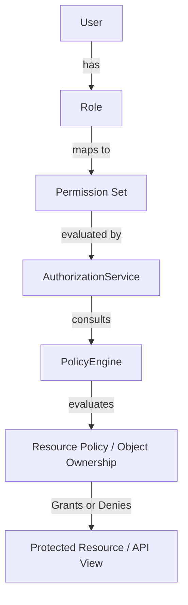
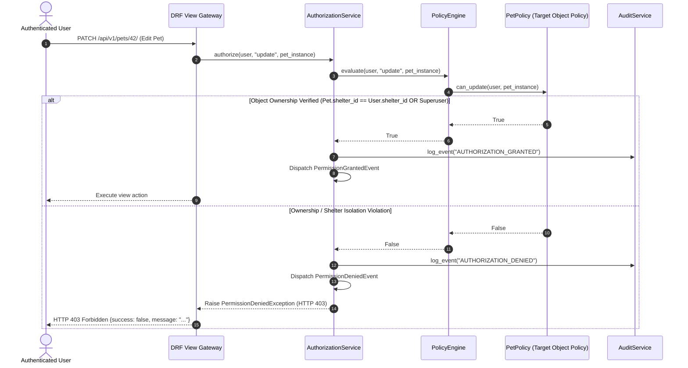

# PawMatch Authorization Architecture Foundation (Phase 1.5.5)

```text
Document ID:     ARCHITECTURE-AUTHORIZATION_FOUNDATION
Status:          Approved Production Architecture Blueprint
Version:         1.5.5
Document Owner:  PawMatch Core Architecture & Security Team
Target Audience: Software Engineers, AI Coding Agents, DevOps, Security Engineers
Last Updated:    July 31, 2026
```

---

## 1. Overview & Architectural Principles

The PawMatch Authorization Framework provides a multi-layered, production-grade access control infrastructure answering the fundamental security question:

$$\text{WHO (User/Role)} \xrightarrow{\text{can perform}} \text{WHAT (Permission/Action)} \xrightarrow{\text{on}} \text{WHICH RESOURCE (Object)} \xrightarrow{\text{under}} \text{WHICH CONDITIONS (Policy)}$$



---

## 2. Authorization Layers

1. **Permission Registry (`apps/accounts/permissions.py`)**: Centralized string constants (`pets.view`, `pets.create`, `shelters.manage`, `medical.manage`, etc.).
2. **Role Definitions (`apps/accounts/roles.py`)**: Platform role constants (`ADMINISTRATOR`, `SHELTER_MANAGER`, `SHELTER_STAFF`, `VETERINARIAN`, `VOLUNTEER`, `ADOPTER`).
3. **Role $\rightarrow$ Permission Mapping (`apps/accounts/role_permissions.py`)**: Declarative mapping dictionary assigning permission sets to roles.
4. **Policy Engine & Policies (`apps/accounts/policies/`)**: Object-level policy evaluation classes (`UserPolicy`, `PetPolicy`) inspecting ownership and multi-tenant isolation.
5. **Authorization Service (`apps/accounts/services/authorization_service.py`)**: Single service entry point executing authorization checks, emitting security events, and recording audit logs.
6. **DRF Permission Classes & Decorators (`permissions_drf.py` & `auth_decorators.py`)**: Declarative view-level enforcement tools (`HasPermission`, `HasRole`, `HasObjectPermission`, `@require_permission`, `@require_role`).

---

## 3. Policy Engine & Multi-Tenant Object Ownership Specification

Policies extend `BasePolicy` and implement `can_view`, `can_create`, `can_update`, `can_delete`, or generic `can_action`.



---

## 4. Multi-Tenant Shelter Isolation & Extension Strategy

Future business modules (Shelters, Pets, Adoptions, Medical Records) integrate seamlessly by defining a subclass of `BasePolicy` in their respective domain packages and registering it with `PolicyEngine.register_policy(ModelClass, PolicyClass)` without modifying core authentication/authorization code.
