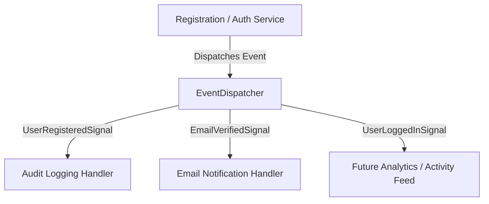
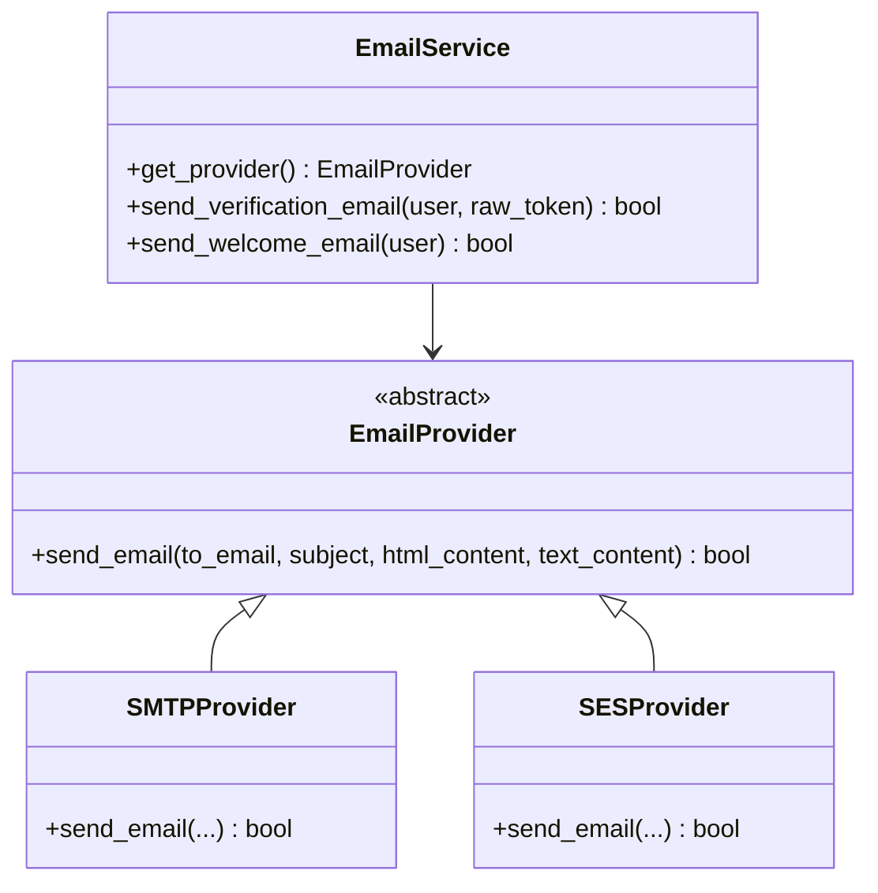

# PawMatch Authentication Architecture Blueprint (Phase 1.3.5 Refined)

```text
Document ID:     ARCHITECTURE-AUTH_REFINED
Status:          Approved Production Architecture Blueprint
Version:         1.3.5
Document Owner:  PawMatch Core Architecture Team
Target Audience: Software Engineers, AI Agents, DevOps, Security Engineers
Last Updated:    July 31, 2026
```

---

## 1. Executive Summary & Package Layout

Phase 1.3.5 introduces a modular, scalable, event-driven, and highly maintainable architecture for the PawMatch Accounts & Authentication subsystem (`apps/accounts/`).

### Clean Directory Structure

```text
apps/accounts/
├── admin.py                  # Django Admin UI interfaces
├── config.py                 # Centralized settings & configuration accessor
├── constants.py              # Magic strings, audit action names, throttle scopes, text constants
├── events.py                 # Lightweight event classes & Django signal dispatchers
├── exceptions.py             # Domain-specific API & business logic exception hierarchy
├── utils.py                  # SHA-256 token hashing, secure raw generators, client metadata parsers
├── throttles.py              # DRF Rate limit throttle policies (LoginAnon, LoginUser, Register, Resend)
│
├── models/
│   ├── __init__.py           # Package exports (User, AccountToken, AccountTokenType)
│   ├── user.py               # Custom User model (UUID, AbstractBaseUser, PermissionsMixin)
│   └── account_token.py      # Reusable generic AccountToken model (SHA-256 hashed, JSON metadata)
│
├── services/
│   ├── authentication_service.py # Authentication, JWT generation, token blacklisting
│   ├── registration_service.py   # User onboarding, verification token lifecycle
│   └── email_service.py          # EmailProvider strategy engine & template dispatch
│
├── validators/
│   ├── __init__.py           # Package exports (validate_email_unique, validate_password_confirmation, etc.)
│   ├── email.py              # Email normalization & uniqueness validators
│   ├── password.py           # Password confirmation & Django strength validators
│   └── phone.py              # Phone number formatting validators
│
├── api/
│   ├── serializers.py        # DRF input/output serializers
│   ├── views.py              # DRF API endpoint views using standard api_response
│   └── urls.py               # Versioned REST URL routing rules
│
├── templates/
│   └── emails/
│       ├── verification_email.html # HTML verification email template
│       └── welcome_email.html      # HTML welcome email template
│
├── documentation/
│   ├── AUTH_ARCHITECTURE.md  # Architectural specification (this document)
│   └── REGISTRATION_FLOW.md  # Registration lifecycle & token specification
│
└── tests/
    ├── test_models.py        # User & AccountToken unit tests
    ├── test_authentication.py# JWT, rate limiting, and logout integration tests
    └── test_registration.py  # Registration, token verification, events & validator tests
```

---

## 2. Generic `AccountToken` Design Specification

Instead of specialized single-purpose token tables, PawMatch utilizes a generic `AccountToken` table designed to support all current and future token-based features (Email Verification, Password Reset, Email Change, Account Invitations).

### Schema Definition

```text
Table: accounts_accounttoken
├── id          : UUID (Primary Key)
├── user_id     : UUID (FK -> accounts_user.id, ON DELETE CASCADE)
├── token_hash  : CharField(128, db_index=True)  -- SHA-256 hash of raw token
├── token_type  : CharField(32, db_index=True)   -- AccountTokenType (EMAIL_VERIFICATION, PASSWORD_RESET, etc.)
├── expires_at  : DateTimeField(db_index=True)   -- Expiration timestamp
├── used_at     : DateTimeField(null=True)        -- Consumption timestamp
├── is_active   : BooleanField(default=True)      -- Active status
├── metadata    : JSONField(default={})          -- Additional context (e.g. new_email, ip, device)
├── created_at  : DateTimeField()
└── updated_at  : DateTimeField()
```

### Security Principles
- **No Raw Token Storage**: Database persists **only SHA-256 hashes** (`token_hash = hash_token(raw_token)`).
- **Single-Use Enforcement**: Tokens are invalidated (`used_at = now()`, `is_active = False`) upon use.
- **Automatic Invalidation**: Generating a new token of a given `token_type` invalidates all previous active tokens for that user.

---

## 3. Event-Driven Architecture Specification

To decouple side-effects (Audit Logging, Email Notifications, Analytics) from domain services, PawMatch utilizes lightweight event dataclasses and Django signals (`apps/accounts/events.py`).



### Events Table

| Event | Dispatched When | Primary Listener Action |
|---|---|---|
| `UserRegisteredEvent` | New user account created | Dispatches verification email & logs `REGISTRATION_SUCCESS` |
| `EmailVerifiedEvent` | Account verified | Dispatches welcome email & logs `EMAIL_VERIFICATION_SUCCESS` |
| `UserLoggedInEvent` | Credentials verified | Updates `last_login` & logs `LOGIN_SUCCESS` |
| `UserLoggedOutEvent` | Refresh token blacklisted | Logs `LOGOUT_SUCCESS` |

---

## 4. Email Provider Strategy Architecture

`EmailService` uses the **Strategy Pattern** to support pluggable email delivery backends (`SMTP`, `SES`, `SendGrid`, `Resend`) configured via `accounts_config.email_provider_backend`.



---

## 5. Domain Exceptions & API Response Envelope

All API endpoints produce standardized JSON responses using `api_response` from [`apps/core/responses.py`](file:///home/spidy/Desktop/projects/PawMatch/backend/apps/core/responses.py).

Custom domain exceptions in [`apps/accounts/exceptions.py`](file:///home/spidy/Desktop/projects/PawMatch/backend/apps/accounts/exceptions.py) inherit from `APIException`, allowing DRF's exception handler to automatically format errors into uniform JSON payloads:

```json
{
    "success": false,
    "message": "Verification token is invalid, expired, or already used.",
    "errors": {
        "detail": "Verification token is invalid, expired, or already used."
    }
}
```
