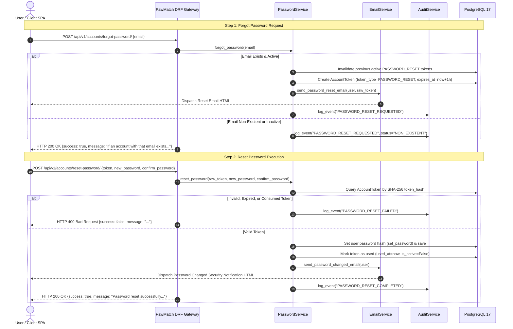

# PawMatch Password Management Architecture

```text
Document ID:     ARCHITECTURE-PASSWORD_MANAGEMENT
Status:          Approved Production Architecture Blueprint
Version:         1.5.0
Document Owner:  PawMatch Core Security & Architecture Team
Target Audience: Software Engineers, AI Agents, DevOps, Security Auditors
Last Updated:    July 31, 2026
```

---

## 1. Overview & Password Lifecycle

PawMatch provides a secure, production-grade password management subsystem supporting authenticated password changes, user-enumeration-resistant forgot password workflows, token-based password resets via generic `AccountToken` models, and security confirmation notifications.



---

## 2. Security Guarantees & Principles

1. **User Enumeration Prevention**: `POST /api/v1/accounts/forgot-password/` returns identical HTTP 200 success responses regardless of whether the email exists in the database.
2. **Generic `AccountToken` Reuse**: Uses `AccountTokenType.PASSWORD_RESET`. Database persists only SHA-256 hashes (`token_hash`), never raw tokens.
3. **Single-Use & Expiration**: Tokens expire in **1 hour** (`PASSWORD_RESET_TOKEN_EXPIRY_HOURS`) and are marked consumed (`used_at = now()`) upon use.
4. **Password Validation Rules**:
   - Rejects passwords not matching `confirm_password`.
   - Rejects new passwords identical to current password (`validate_password_not_same`).
   - Rejects recently used passwords (`validate_password_not_reused`).
   - Enforces Django's standard password strength rules (`MinimumLength`, `CommonPassword`, `NumericPassword`).
5. **Security Notifications**: Successful password changes or resets immediately dispatch a security alert HTML email (`password_changed_email.html`).

---

## 3. API Specification Summary

| Endpoint | Method | Permission | Rate Limit | Description |
|---|---|---|---|---|
| `/api/v1/accounts/change-password/` | POST | `IsAuthenticated` | - | Authenticated password change requiring current password |
| `/api/v1/accounts/forgot-password/` | POST | `AllowAny` | `3/min` | Initiates password reset link dispatch |
| `/api/v1/accounts/reset-password/` | POST | `AllowAny` | `3/min` | Resets password using cryptographically verified reset token |
