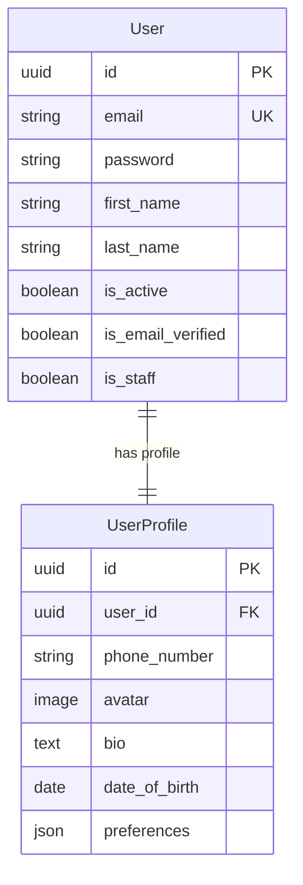
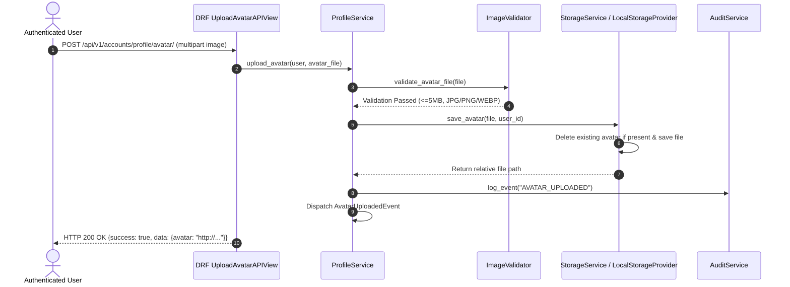
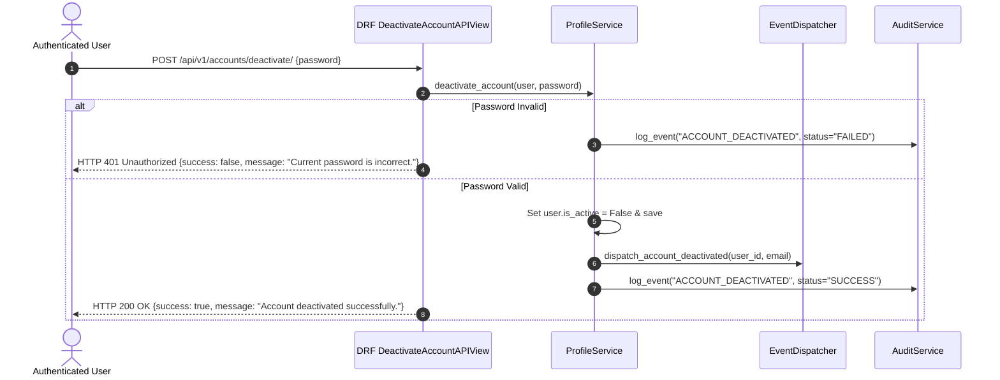

# PawMatch User Profile Management Architecture

```text
Document ID:     ARCHITECTURE-PROFILE_MANAGEMENT
Status:          Approved Production Architecture Blueprint
Version:         1.4.0
Document Owner:  PawMatch Core Architecture Team
Target Audience: Software Engineers, AI Agents, DevOps, Security Engineers
Last Updated:    July 31, 2026
```

---

## 1. Overview & One-to-One User Profile Architecture

PawMatch separates authentication identity (`User` model) from domain user profile details (`UserProfile` model) via a strict `OneToOneField` relationship.



### Automatic Profile Creation
Every newly created `User` receives a corresponding `UserProfile` instance automatically via the `post_save` signal in [`apps/accounts/signals.py`](file:///home/spidy/Desktop/projects/PawMatch/backend/apps/accounts/signals.py).

---

## 2. Avatar Storage & Media Lifecyle Architecture

Avatar media management uses a modular `StorageService` with a `StorageProvider` strategy pattern (`LocalStorageProvider`).



---

## 3. Account Deactivation Sequence

Account deactivation is a soft operation (`is_active = False`) requiring current password verification:



---

## 4. API Specification Summary

| Endpoint | Method | Permission | Description |
|---|---|---|---|
| `/api/v1/accounts/profile/` | GET | `IsAuthenticated` | Retrieves authenticated user profile |
| `/api/v1/accounts/profile/` | PATCH | `IsAuthenticated` | Updates personal details and preferences |
| `/api/v1/accounts/profile/avatar/` | POST | `IsAuthenticated` | Uploads profile avatar (<=5MB, JPG/PNG/WEBP) |
| `/api/v1/accounts/profile/avatar/` | DELETE | `IsAuthenticated` | Deletes profile avatar |
| `/api/v1/accounts/deactivate/` | POST | `IsAuthenticated` | Soft deactivates account with password verification |
