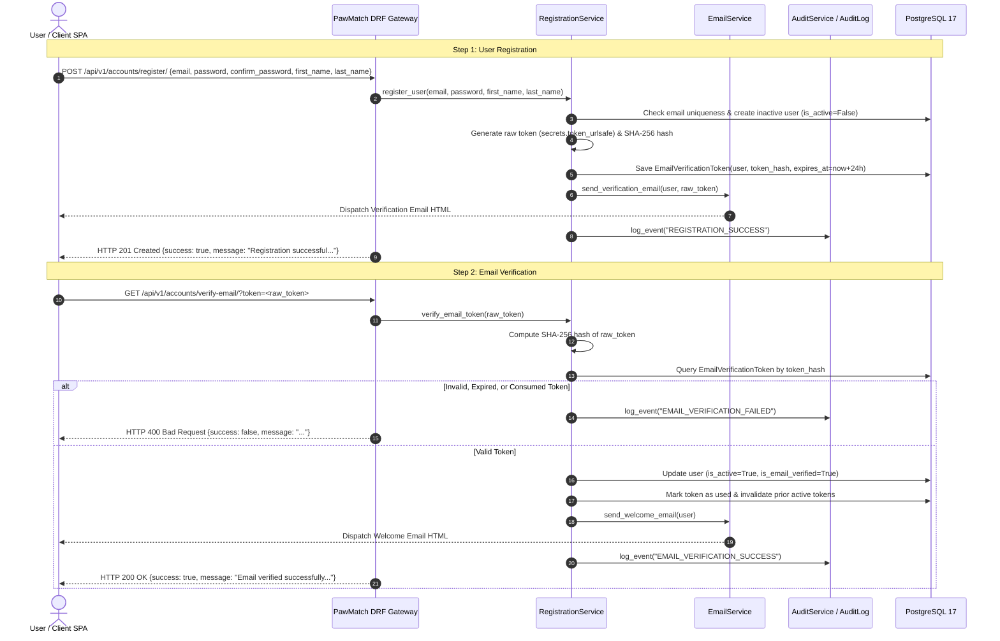

# PawMatch User Registration & Email Verification Architecture

```text
Document ID:     ARCHITECTURE-REGISTRATION_FLOW
Status:          Approved Blueprint
Version:         1.3.0
Document Owner:  PawMatch Architecture & Security Team
Target Audience: Software Engineers, DevOps, Security Auditors, AI Coding Agents
Last Updated:    July 31, 2026
```

---

## 1. Overview

PawMatch implements a secure, asynchronous user onboarding lifecycle with **Email Verification Tokens**, **SHA-256 Token Hashing**, **Transactional Email Services**, and **Security Audit Logging**.

---

## 2. Registration & Account Activation Sequence Diagram



---

## 3. Verification Token Security Specification

- **Token Generation**: Cryptographically secure 32-byte URL-safe string (`secrets.token_urlsafe(32)`).
- **Database Storage**: Raw tokens are **NEVER** stored in database tables or logs. Database persists only the `SHA-256` hash (`token_hash`).
- **Token Expiration**: Default **24 hours** (`EMAIL_VERIFICATION_TOKEN_EXPIRY_HOURS`).
- **Single-Use Enforcement**: Upon successful verification, token is marked `used_at = now()` and `is_active = False`.
- **Resend Invalidation**: Generating a new verification token automatically invalidates all previous active tokens for that user.

---

## 4. Transactional Email Architecture

- **`EmailService`**: Decouples email composition and delivery from domain logic.
- **HTML & Plain Text Support**: Uses Django template rendering (`apps/accounts/templates/emails/verification_email.html` and `welcome_email.html`).
- **Configurable Frontend URLs**: Bound dynamically via `FRONTEND_URL` and `FRONTEND_VERIFY_EMAIL_URL`.
