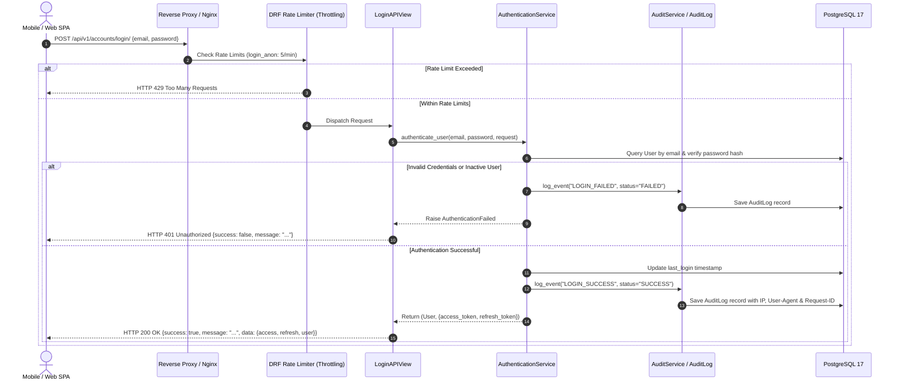

# PawMatch Authentication & JWT Security Architecture

```text
Document ID:     ARCHITECTURE-AUTHENTICATION_FLOW
Status:          Approved Blueprint
Version:         1.2.5
Document Owner:  PawMatch Architecture & Security Team
Target Audience: Software Engineers, DevOps, Security Auditors, AI Coding Agents
Last Updated:    July 31, 2026
```

---

## 1. Overview

PawMatch uses a production-grade **JSON Web Token (JWT)** authentication framework built on **Django REST Framework SimpleJWT**, **Custom User Manager**, **Rate Limiting Throttles**, and an **Immutable Audit Logging** pipeline.

---

## 2. Authentication Flow Sequence Diagram



---

## 3. JWT Token Lifecycle & Security Parameters

| Token Type | Lifetime | Storage Recommendation | Behavior |
|---|---|---|---|
| **Access Token** | **15 Minutes** | In-memory SPA state / HttpOnly Cookie | Short-lived bearer token used in `Authorization: Bearer <access_token>` headers. |
| **Refresh Token** | **7 Days** | Secure HttpOnly Cookie / Secure Storage | Used to obtain fresh access tokens via `POST /api/v1/accounts/token/refresh/`. |

### Token Rotation & Blacklisting Configuration
- **Rotation Enabled (`ROTATE_REFRESH_TOKENS = True`)**: Every token refresh invocation invalidates the current refresh token and issues a brand-new access/refresh token pair.
- **Blacklisting (`BLACKLIST_AFTER_ROTATION = True`)**: Rotated and logged-out refresh tokens are persisted in `token_blacklist` database tables, preventing replay attacks.

---

## 4. Rate Limiting Protection (Throttling)

Authentication endpoints are protected against brute-force credential stuffing and denial-of-service attacks:

- **Unauthenticated Login Attempt Limit (`login_anon`)**: Default **5 requests / minute**.
- **Authenticated Account Limits (`login_user`)**: Default **20 requests / minute**.
- Configurable dynamically via environment variables (`THROTTLE_LOGIN_ANON`, `THROTTLE_LOGIN_USER`).

---

## 5. Security Audit Trail & Metadata Capture

Every authentication event (`LOGIN_SUCCESS`, `LOGIN_FAILED_CREDENTIALS`, `LOGIN_FAILED_DISABLED`, `LOGOUT_SUCCESS`, `LOGOUT_FAILED`, `TOKEN_REFRESH_SUCCESS`, `TOKEN_REFRESH_FAILED`) automatically captures:

- **Client Metadata**: IP Address, User-Agent, Browser, Operating System, Device Type.
- **Distributed Tracing**: Unique `Request-ID` attached to thread context and response headers.
- **Data Privacy Enforcement**: Passwords, raw JWT tokens, and sensitive headers are **NEVER** stored in audit records or log files.
